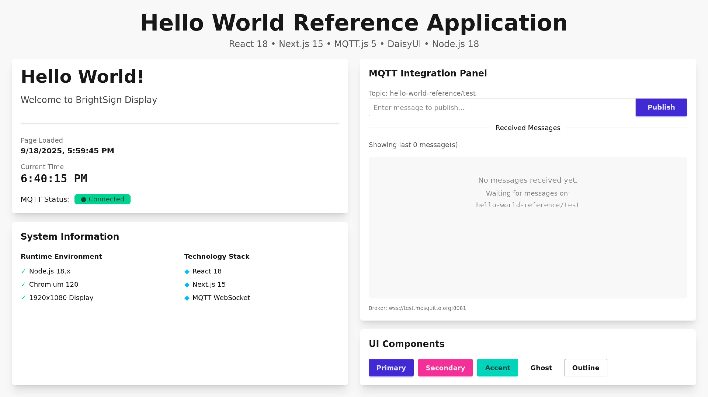
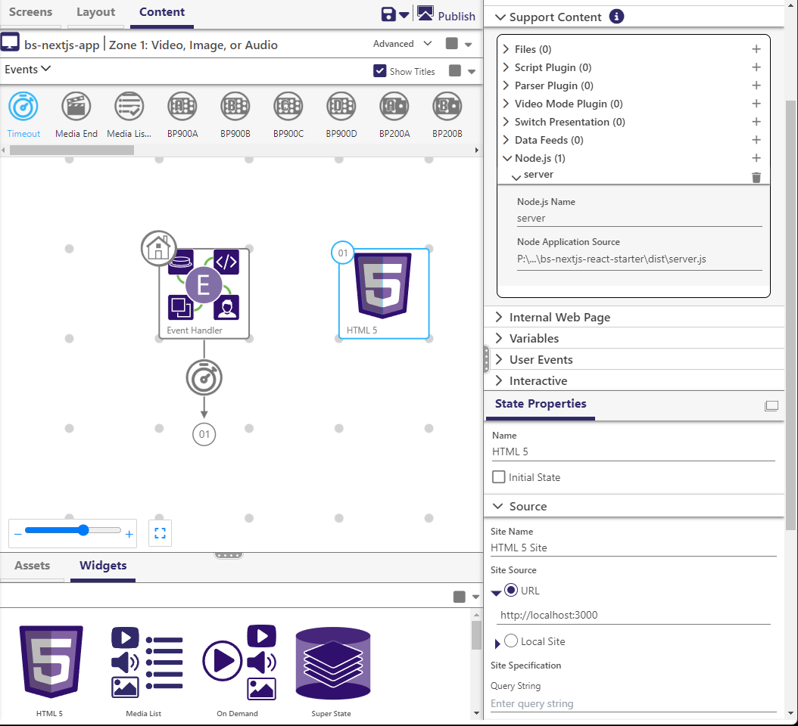

# BrightSign Next.js React Starter

A Next.js web application template for BrightSign media players with MQTT integration, designed for deployment via BrightAuthor:connected.



## Overview

This is a production-ready Next.js application that:
- Runs on BrightSign media players with OS 9.1.x+ (Node.js 18+ and Chromium 120)
- Includes MQTT messaging for real-time communication
- Builds to a single `server.js` entry point for easy deployment
- Integrates with BrightAuthor:connected for presentation management

## Quick Start

### Development
```bash
# Install dependencies
npm install

# Run development server
npm run dev
```

### Production Build
```bash
# Build the application
npm run build

# Create single entry point (dist/server.js)
npm run build:entry

# Test locally
npm start
```

## BrightSign Deployment



### Using BrightAuthor:connected

1. **Open the Presentation**
   - Navigate to the `presentation/` folder
   - Open `bs-nextjs-app.bpfx` in BrightAuthor:connected

2. **Configure the Presentation**
   - Ensure the `server.js` file from `dist/` is linked to your project
   - Set the Node.js application to run `server.js`
   - Configure the HTML widget to load `http://localhost:3000`

3. **Publish to BrightSign**
   - Connect to your BrightSign player
   - Ensure the player is running OS 9.1.x or higher (required for Node.js 18+ and Chromium 120)
   - Publish the presentation

## Project Structure

```
bs-nextjs-react-starter/
├── dist/                  # Production build output
│   └── server.js         # Single entry point for BrightSign
├── presentation/         # BrightAuthor:connected files
│   └── bs-nextjs-app.bpfx
├── docs/                 # Documentation assets
├── src/                  # Source code
│   ├── app/             # Next.js app router
│   ├── components/      # React components
│   └── lib/            # Utilities and MQTT client
└── scripts/             # Build scripts
```

## Features

- **Next.js 15** with App Router
- **React 19** with TypeScript
- **MQTT Integration** via WebSocket
- **Tailwind CSS + DaisyUI** for styling
- **Single Entry Point** deployment (`server.js`)
- **BrightAuthor:connected** presentation included

## Configuration

Environment variables (`.env.local`):
```env
PORT=3000
NEXT_PUBLIC_MQTT_BROKER=wss://test.mosquitto.org:8081
NEXT_PUBLIC_MQTT_TOPIC=hello-world-reference/test
```

## Requirements

- **Development**: Node.js 18+
- **BrightSign Player**: OS 9.1.x or higher
- **BrightAuthor:connected**: Latest version

## License

MIT